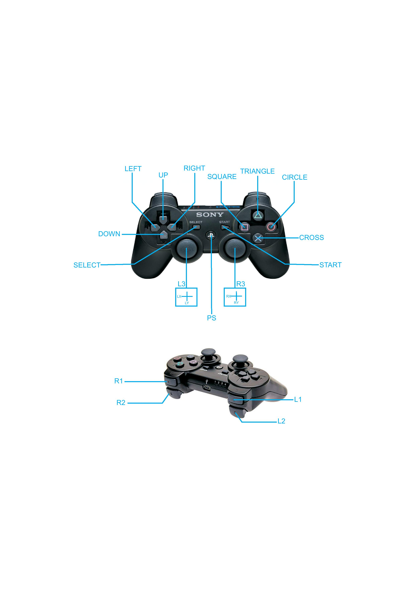

# **PS3**
This library is used to get data of PS3 from esp32 through SPI communication.

## **How To Use**

 Include zip file of library ,then first open esp32_SPI_PS3 from examples then install PS3 Controller library from https://github.com/jvpernis/esp32-ps3 then enter the mac address in #define macAddress “your PS3 mac address”,then upload the code to esp32.

Then create a new sketch and include this library then create a object of PS3 then use the library function acc to your use.
  
## **Functions** 

**begin():** This function will begin SPI communication.**begin() is mandatory to call in void setup.**

**getButtonPress(BUTTON_NAME) :** This function will return the state of the button whose name is passed in argument  . If button is pressed it will return 1 else 0. Data type bool.

**getButtonClick(BUTTON_NAME) :** This function will return 1 when state of the button passed in argument changed from 0 to 1. Data type bool.

**getButtonRelease(BUTTON_NAME):** This function will return 1 when state of the button passed in argument changed from 1 to 0.Data type bool.

**getAnalogHat(AXIS_NAME) :**  This function will return the value of joystick axis passed in argument .Data type int .Range of value is -128 to 127. 
**printAnalogHat() :** This function will serial print the value of joystick.  

**printButton() :**This function will serial print the name of button you will press.

**Note – printAnalogHat() and printButton() will only  work if Serial.begin() is called in void setup.**

**Note – BUTTON and AXIS names are as shown in figure, names are case sensitive.**

